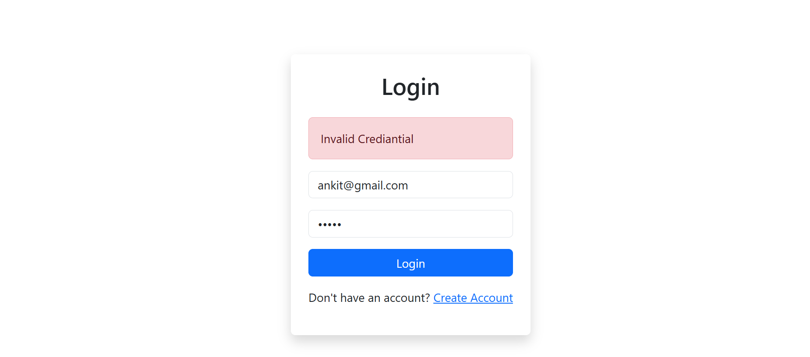

# Project Title: User Management System

An User Management System built with React.js for the frontend and Node.js/Express.js for the backend. This application allows users to register, log in, manage their profiles, and perform CRUD operations on employee data, including time management functionalities.

## Table of Contents
- [Features](#features)
- [Screenshots](#screenshots)
- [Technologies Used](#technologies-used)
- [Installation](#installation)
- [Frntend and Backend Port](#port)

## Features
- User registration and authentication
- Profile management (edit name, email, password)
- User management (view and edit)

## Screenshots




## Technologies Used
- **Frontend:**
  - React.js
  - React Router
  - Bootstrap
  - fech (for API calls)
  - state-management(context)

- **Backend:**
  - Node.js
  - Express.js
  - MongoDB (with Mongoose)

- **Authentication:**
  - JSON Web Tokens (JWT)
  - Bcrypt (for password hashing)

- **Development Tools:**
  - Git
  - Visual Studio Code
  - Postman (for API testing)

## Installation
1. Clone the repository:
   ```bash
   git clone https://github.com/yourusername/employee-management-system.git

 **Frontend and backend port:**
 -frontend Poer :-http://localhost:3000/
 -Backend port no:-http://localhost:4000/
